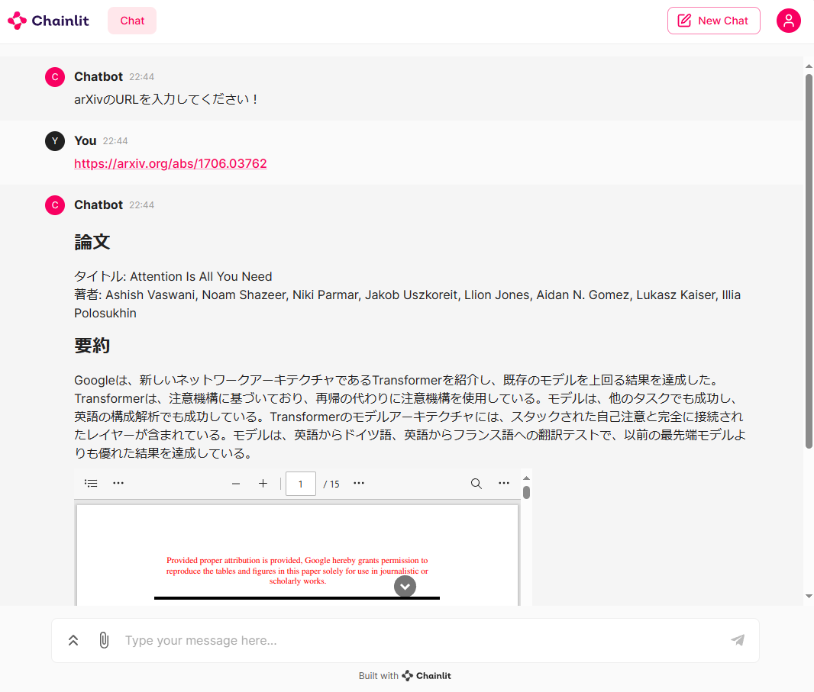

# arXiv ChatGPT



## Introduction

arXiv の URL から論文を取得し要約するチャットツールです。LangChain で ChatGPT を使用し、Chainlit でチャット UI を作成します。

## Features

- arXiv の論文取得: URL から ArxivRetriever を挟んで PDF をダウンロードします
- 要約: 論文の内容を簡潔に要約します
- インタラクティブチャット: ユーザーが質問を行い、取得したドキュメントの内容に基づいて回答を得ることができます。

## Setup

1. `requirements.txt` に記載されているライブラリをインストールする

```
$ pip install -r requirements.txt
```

2. `chainlit` を起動する

```
$ chainlit run main.py
```

## Limited

- OpenAI の API にしか対応していません

## Future Enhancements

- ストリーミングの対応
- 複数 PDF の対応
- 要約精度の向上
